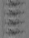

## [CUAVE dataset](http://people.csail.mit.edu/siracusa/avdata/)

> a new, flexible, and fairly comprehensive audiovisual database

The CUAVE database is a speaker independent corpus of over 7,000 utterances of both connected and isolated digits. 


36 speakers saying the digits *0* to *9*. The *normal* portion of the database contains frontal facing speakers saying each digits 5 times. 

In the ```cuave-group-aligned``` directory, there are extracted and aligned faces, along with the audio features for all "group" sequences in the CUAVE database.

Every individual sequence contains a 2 element cell array containing grayscale video frames, one 75\*50\*n frame matrix for each person. It also has frame indexed raw audio and MFCCs in variables ```audioIndexed``` and ```mfccs```. Ground truth labeling is in the variable "labels". 

The elements contained in each ```g_aligned.mat``` are listed as follows.
* **video** { [75\*50\*n] [75\*50\*n] }
* **audioIndexed** {[534\*n]}
* **mfccs** { [13*n] }
* **labels** { [1*n] }
* frameNumbers
* fps
* fs [16000]
* flowX
* flowY
* flowStats

The video frames are double-size of mfccs or other audio data, which motivates to use the second part video frames as unlabelled data in the feature learning. The video frames can also be visualized via ```visualize_frame()``` in ```utility.py```. Four examples in the frames are displayed as below.

| | 1st | 2nd | 3rd | 4th |
|-| --  | --  | --  | --  |
|1|  |  |  |  |
|2|  |  |  | 

## spectrogram

A spectrogram is a visual representation of the spectrum of frequencies of a signal as it varies with time. A common format is a graph with two geometric dimensions: one axis represents time, the other axis is frequency; a third dimension indicating the amplitude of a particular frequency at a particular time is represented by the intensity or color of each point in the image. The dimension for spectrogram in CUAVE is 129x2. 


## [AV Letters](http://www.ee.surrey.ac.uk/Projects/LILiR/datasets/avletters1/index.html)

This dataset was generated in 1998 at the University of East Anglia, and it contains letters 'A' and 'Z' spoken by 10 speakers with 3 repetitions for each letter totalling 780 utterances, 18562 frames with mouth region (lips) 60*80 pixels in greyscale. 

The mfcc file ```F2_Bill.mfcc``` has the dimensionality 49*26

The frame file ```F2_Bill-lips.mat``` is a dictionary, which has two key-value pairs.
* vid {4800*25}
* siz {60\*80\*25}

Some examples of the lip regions are visualized as below.
| 1st | 2nd | 3rd | 4th |
| --  | --  | --  | --  |
|  |  |  |  |

## tree-structure

```tree
dataset
|__ avletters 
|   |__ Audio
|   |   |__ mfcc
|   |   |   |__ Clean
|   |   |   |   |__ [A:Z][1,2,3]_[name].mfcc
|   |__ Lips
|   |   |__ [A:Z][1,2,3]_[name]-lips.mat
|__ cuave-group-aligned
|   |__ g[01:22]_aligned.mat
|__ processed
|   |__ avletters
|   |   |__ concat_data.npy
|   |   |__ frames.npy
|   |   |__ labels.npy
|   |   |__ mfccs.npy
|   |__ cuave
|   |   |__ audio.npy
|   |   |__ concat_data_1.npy
|   |   |__ concat_data_2.npy
|   |   |__ frames_1.npy
|   |   |__ frame_2.npy
|   |   |__ frames_pca_1.npy
|   |   |__ frames_pca_1.npy
|   |   |__ labels.csv
|   |   |__ mfccs.csv
|__ dataset2.mat
```

## note 

When using ```np.savetxt``` to save ```np.array``` to csv files, the module will check the dimensionality of the array, and it will reject the write if the array is more than 2D. Use ```np.save``` instead to save arrays to ```.npy``` files.